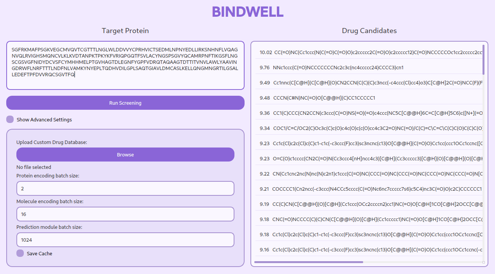
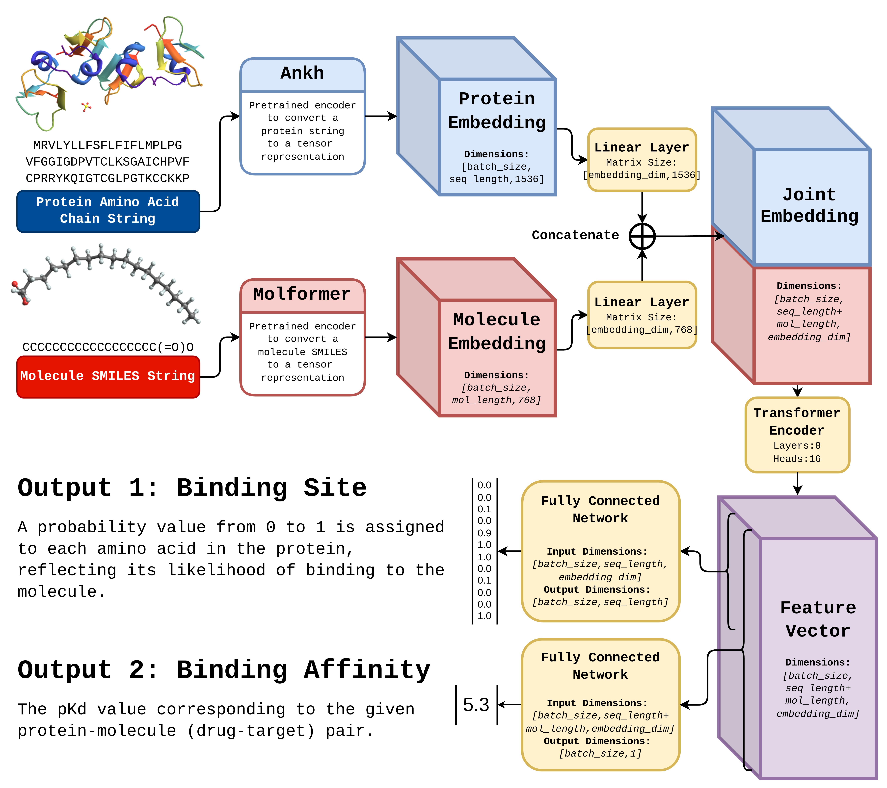

# **BINDWELL: The intelligent approach to therapeutic development, powered by AI**

[**Installation Instructions**](docs/Installation.md)

[**Model Performance**](docs/Validation.md)

**Inspiration**
---------------

Bindwell revolutionizes pesticide development through AI-powered virtual screening. We're developing an end-to-end, region-specific pesticide discovery platform that combines:

1. Predictive models for region-specific pathogen, pest, and climate forecasts (WaterGate Model).
2. AI-powered drug discovery for targeted pesticides (AffinityLM and DrugDiscoveryGPT models).

Our technology has the potential to reduce crop losses by 30% and pesticide use by 25%, saving farmers billions annually.

### **Key Features:**: 

Drug discovery is the process of finding new medicines that target specific proteins in the body to treat or cure diseases. It starts with researchers screening thousands or millions of compounds to identify those that bind effectively to a particular protein, winnowing down millions of possible drugs to a few hundred promising leads. This incredibly labor-intensive and costly step is the most critical in the preclinical phase.

**What is Bindwell?**
---------------

1. **Speed**: Screens 700,000 compounds per second (vs. weeks for traditional methods).
2. **Sequence-based**: Works with any protein, no 3D structure needed.
3. **Comprehensive**: Predicts binding affinity rather than binary hits.
4. **Data-rich**: Trained on 20 million drug-protein pairs, the largest dataset ever used in the field.Both methods are time-consuming, costly, and have limitations [4], such as requiring large amounts of time-prohibitive high quality 3D data and computational resources.

Bindwell's innovation: AffinityLM, our AI model that predicts drug-protein interactions with unprecedented speed and accuracy.

### **How it works:**

1. **Input**: Target protein sequence
2. **Process**: AI-based screening against a standard library of 50,000 drug-likely compounds
3. **Output**: Top 100 drug candidates with binding predictions

Bindwell aims to revolutionize pharmaceutical R&D, ultimately bringing life-saving drugs to market faster and more affordably.

**Bindwell's Accomplishments**
---------------------------------

* **Incredible Inference Time**: Screens ~700,000 molecules per second on consumer hardware, meaning it can screen the entire corpus of known organic chemicals (177 million) in just 4.5 minutes, a 242-year long process with traditional methods [5].
* **Successful Prediction of SARS-CoV-2 Inhibitors**: Predicted drug inhibitors for SARS-CoV-2 with 85% concordance with existing research [6].
* **State-of-the-art Accuracy**: Our AffinityLM model matches or surpasses the accuracy of industry models on multiple independant benchmarks.

**Impact**
---------------

## **Impact**

Bindwell's approach to pesticide discovery offers incredible implications for agriculture and environmental sustainability:

* **Targeted Solutions**: Enables farmers to apply precise, environmentally-friendly pesticides tailored to their regional pathogens/pests.
* **Cost and Time Savings**: Offers a nearly 100% cost reduction compared to traditional methods, while screening thousands of times more compounds.
* **Environmental Protection**: Potential to significantly reduce pesticide use and its ecological impact.

**Building Bindwell**
-------------------

We developed Bindwell's AffinityLM model by training it on a dataset of 20 million drug-target pairs from BindingDB and Uniprot, the largest dataset ever used for this task. AffinityLM uses two language models to encode protein and ligand sequences, followed by linear transformations, concatenation, self-attention, and two prediction heads for binding affinity and site (Pictured above). We implemented AffinityLM in PyTorch, trained it in 39 hours on consumer hardware, and created a user-friendly frontend with PyQT5. Bindwell and AffinityLM represent a significant milestone in AI-driven drug discovery, with the potential to the field.

**Challenges Bindwell Faced**
-----------------------

* **Data Scarcity and Overfitting**: With only 2 million publically available binding affinities, to prevent overfitting, we developed the AffinityLM architecture to leverage the 18 million protein-ligand binding sites, enabling a small model without sacrificing accuracy.
* **Model Optimization**: Balancing model size and hyperparameters was a significant challenge. We iterated through three models, starting small and scaling up, to avoid sacrificing accuracy for efficiency or vice versa.
* **Effective Caching**: With large molecular embeddings and multiple devices (CPU and CUDA GPU) for inference, to maximize inference times, we had to develop an memory efficient caching method. We made a simple flexible caching strategy that selectively moves data between DRAM and VRAM as needed, though there's still room for improvement. 

**Looking Forward**
---------------------------

We're all deeply committed to contributing to the field of AI-driven drug discovery, and to further accelerate its progress, we plan to publish a research paper detailing our approach in developing AffinityLM. By sharing our work with the scientific community, we also hope to to foster more collaboration and innovation in the pursuit of life-changing therapies, especially admist an AI revolution.

### References:

[1] IQVIA Institute for Human Data Science. (2020). The Use of Medicines in the United States: Review of 2020.

[2] National Opinion Research Center (NORC) at the University of Chicago. (2020). Medication Adherence in America: A National Report Card.

[3] DiMasi, J. A., Grabowski, H. G., & Hansen, R. W. (2014). Cost of developing a new drug. Journal of Health Economics, 47, 20-33.

[4] Kolb, P., & Caflisch, A. (2006). Automatic docking and pharmacophore discovery. Journal of Medicinal Chemistry, 49(24), 7384-7392.

[5] Kolukisaoglu, H. U. (2010). High-throughput screening. In Encyclopedia of Industrial Biotechnology: Bioprocess, Bioseparation, and Cell Technology (pp. 1-13). John Wiley & Sons, Inc.

[6] Beck, B. R., Shin, B., Choi, Y., Park, S., & Kang, K. (2020). Predicting commercially available antiviral drugs that may be effective against the COVID-19 virus. Journal of Medical Virology, 92(6), 911-920.
